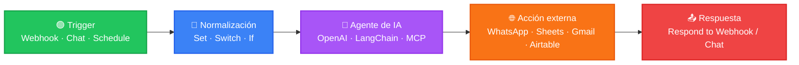
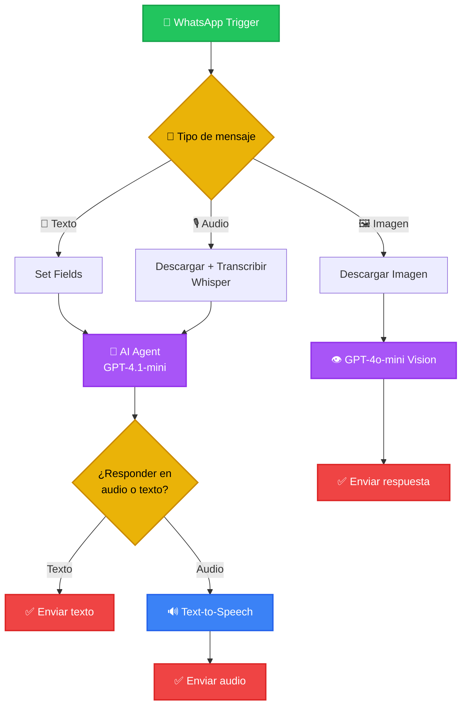

# ⚡ n8n Automations & AI Workflows

### Portafolio de automatizaciones low-code potenciadas con Inteligencia Artificial

---

## 👋 Sobre este repositorio

Aquí no vas a encontrar teoría, sino **flujos funcionando de verdad**. Este repo reúne un conjunto de automatizaciones construidas en **n8n** que integran modelos de IA (texto, voz, visión e imágenes), APIs externas y frontends generados con *vibe coding*, para resolver problemas reales: atención al cliente automatizada, generación de leads, análisis de contenido y agentes conversacionales con acceso a herramientas.

Cada carpeta es un proyecto independiente, documentado y listo para inspeccionar: incluye el **workflow exportado (`.json`)**, capturas del **flujo visual** y un **README propio** con el detalle técnico.

> 💡 El objetivo: demostrar capacidad para diseñar arquitecturas de automatización end-to-end, no solo "conectar nodos".

---

## 🗂️ Proyectos

| Proyecto | Qué hace | Stack clave |
|---|---|---|
| 🤖 [**Bot de WhatsApp**](./Bot%20de%20Whatsapp) | Asistente multimodal: responde texto, transcribe y contesta notas de voz, y analiza imágenes enviadas por el usuario. | GPT-4.1-mini · GPT-4o-mini Vision · Whisper · TTS |
| 🧠 [**Chatbot MCP**](./Chatbot%20MCP) | Agente de IA que usa el protocolo **MCP** para operar Gmail, Airtable y disparar otro workflow de scraping, todo desde un mismo chat. | n8n + LangChain · MCP · Gmail API · Airtable API |
| 📈 [**Scraping de Estrategias de Trading**](./Scraping%20Estrategias%20de%20Trading) | Extrae y clasifica estrategias de TradingView con IA, paginando resultados automáticamente y guardando todo en Sheets. | HTTP Request · HTML Extract · OpenAI · Google Sheets |
| 🗺️ [**Scraping de Google Maps**](./Scraping%20Google%20Maps) | Encuentra universidades en Google Maps, navega sus sitios web y extrae correos de contacto, deduplicados y listos para prospección. | Schedule Trigger · Regex · Web Crawling |
| 🏛️ [**Vibe Coding · Bot de Gobierno**](./Vibe%20Coding%20Bot%20de%20Gobierno) | Backend de un chatbot conectado a un frontend construido con Loveable, vía webhook. | Webhook · AI Agent · GPT-4o-mini |
| 📚 [**Vibe Coding · Generador de Historias**](./Vibe%20Coding%20Generador%20de%20Historias) | Genera microcuentos infantiles personalizados (nombre, animal, deporte) para un frontend en Loveable. | Webhook · AI Agent · GPT-4o-mini |
| 🎨 [**Vibe Coding · Generador de Imágenes**](./Vibe%20Coding%20Generador%20de%20Imagenes) | Convierte texto en imágenes con DALL·E y las devuelve en binario a un frontend hecho en Bolt. | Webhook · OpenAI DALL·E |

---

## 🧩 Arquitectura del sistema

La mayoría de los flujos comparte una misma lógica de diseño, pensada para ser **modular y escalable**:

### 🔍 Caso real: enrutamiento multimodal (Bot de WhatsApp)

Así se ve el patrón aplicado a un flujo real, con ramas de decisión según el tipo de mensaje recibido:

> 🎥 GitHub renderiza estos diagramas automáticamente (son [Mermaid](https://mermaid.js.org/), no imágenes) — se ven así de nítidos directo en el repo, sin necesidad de abrir n8n.

---

## 🛠️ Habilidades demostradas

- **Diseño de agentes de IA** con memoria conversacional y enrutamiento por tipo de intención.
- **Integraciones multimodales**: texto, audio (STT/TTS) e imagen (visión y generación).
- **Model Context Protocol (MCP)** para exponer herramientas externas a un agente.
- **Web scraping estructurado** con paginación, deduplicación y extracción vía regex.
- **Integración de APIs** de terceros: WhatsApp Business, Gmail, Airtable, Google Sheets.
- **Arquitecturas webhook** para conectar frontends (Loveable, Bolt) con backends en n8n.
- **Automatizaciones programadas** (Schedule Trigger) para tareas recurrentes.

---

## ⚙️ Tecnologías

`n8n` · `OpenAI (GPT-4o, GPT-4.1-mini, DALL·E, Whisper)` · `LangChain` · `Model Context Protocol` · `WhatsApp Business API` · `Google Sheets` · `Airtable` · `Gmail API` · `Webhooks` · `Regex / HTML Extract`

---

## 📁 Cómo explorar cada workflow

1. Entra a la carpeta del proyecto que te interese.
2. Revisa su `README.md` para el detalle funcional y el diagrama del flujo.
3. Importa el archivo `.json` directamente en tu instancia de **n8n** (`⋮ → Import from File`) para ver el workflow completo, nodo por nodo.

---

